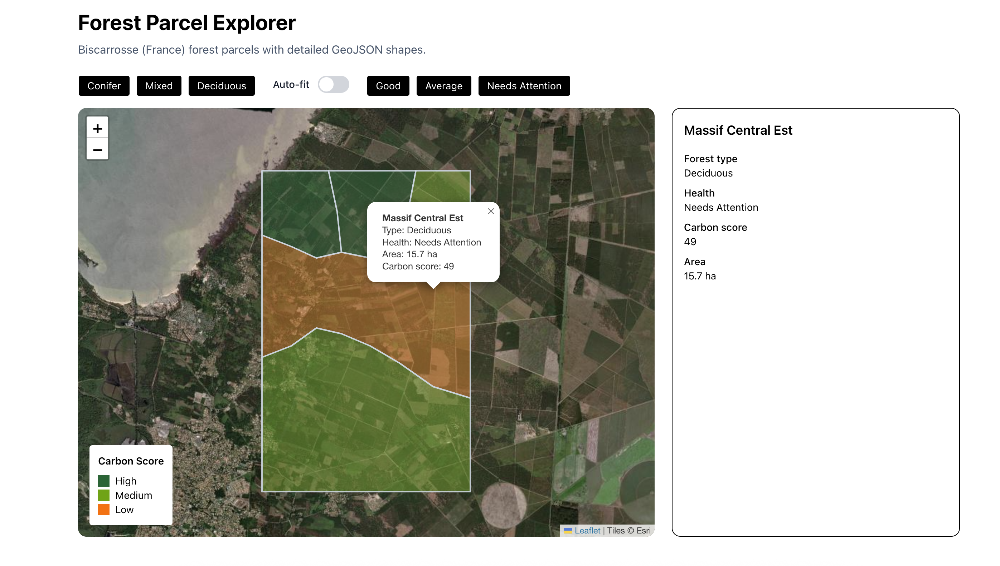
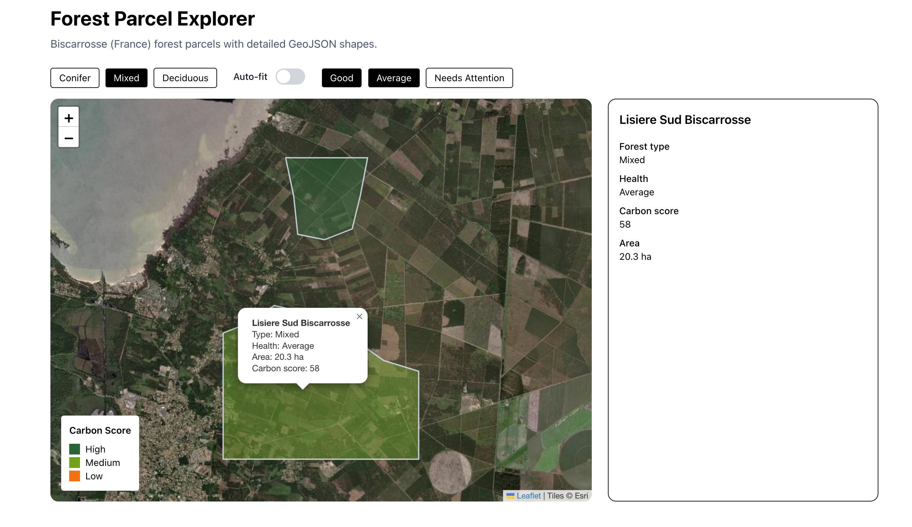

# 🌲 Forest Parcel Explorer

A small geospatial UI demo built with **Next.js, TypeScript, Leaflet, and GeoJSON**.

This project was created to explore interactive map interfaces and better understand how frontend applications can work with geospatial data.

---

## 🚀 Overview

The application displays a set of forest parcels on an interactive map. Each parcel is represented as a GeoJSON polygon and can be selected to view its details.

This project focuses on:

- Rendering GeoJSON data on a map
- Handling user interaction (hover, click)
- Displaying contextual information
- Structuring a clean and maintainable frontend architecture

---

## 📸 Screenshots

### Main Map View



### Filtered Parcels



---

## 🧩 Features (V1)

- Interactive map using Leaflet
- GeoJSON parcel rendering (polygons)
- Dynamic styling based on parcel properties (e.g. carbon score)
- Hover and click interactions
- Popup with parcel information
- Side panel displaying selected parcel details
- Responsive layout

---

## 🛠️ Tech Stack

- **Next.js (App Router)**
- **TypeScript**
- **React Leaflet / Leaflet**
- **Tailwind CSS**
- **GeoJSON**
- **Tanstack/Query**

---

## 📁 Project Structure

```bash
src/
├── app/                 # Next.js app router pages and global styles
├── components/          # Reusable UI components
│   └── map/             # Map-related components (Leaflet)
├── hooks/               # Shared React hooks (data fetching, etc.)
├── types/               # TypeScript types for geospatial data
public/
└── forest-parcels.json  # Local GeoJSON dataset served at runtime
```

---

## 📊 Data

The project uses a small local GeoJSON dataset representing forest parcels.

Each parcel includes:

- name
- forest type
- health status
- carbon score
- area (hectares)

This dataset is intentionally simple and serves as a mock to explore frontend patterns.

---

## 🧠 What I Learned

- How to integrate Leaflet in a Next.js environment (client-only rendering)
- How to render and style GeoJSON features dynamically
- How to handle map interactions (click, hover, popups)
- How to structure a small geospatial UI with reusable components
- Basics of working with spatial data (coordinates, polygons, feature properties)

---

## ▶️ Getting Started

```bash
npm install
npm run dev
```

Open http://localhost:3000
